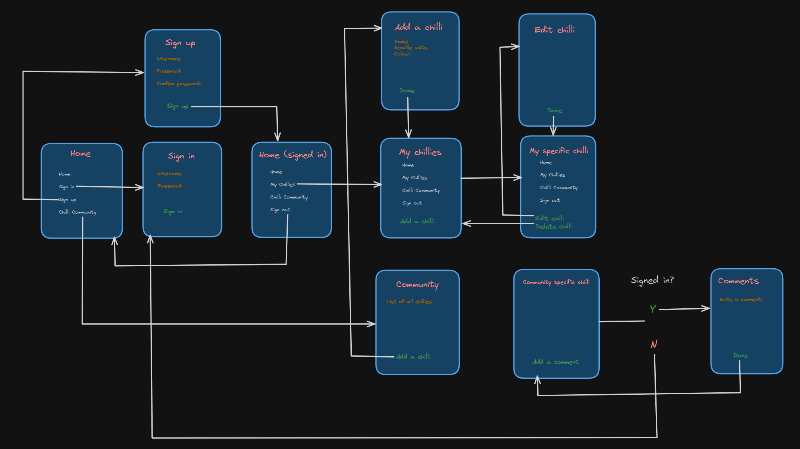

# The Capsaicin Station - deployed link [here](https://capsaicin-station.netlify.app/)

#### Solo project - MEN stack app, made within a week. Users can add information about chillies and view other users' added information about chillies. Chillies have full CRUD functionality.

### Technologies used

#### Front end:
- EJS
- CSS
- JavaScript
- Node.js

#### Back end:
- JavaScript
- Express
- Mongoose
- MongoDB
- dotenv
- bcrypt


---

### Brief

- Use EJS templates for rendering views to users.
- The app uses session-based authentication.
- Keep file structure appropriately organised.
- The app must have a "User" model, as well as at least one more data entity with a relationship to the "User" model.
- Full CRUD functionality.
- Guest users must not be able to create, update or delete data.
- App is deployed online.

---

### Code installation

Run `npm i` to install dependencies.

Go to [MongoDB](https://cloud.mongodb.com/) and create a database.

Create a `.env` file and add the following variables:

```
MONGODB_URI=
SESSION_SECRET=
PORT=
```
Then, to run the app, type the command `node server.js`.

---

### Planning

I created a **Trello** board (located [here](https://trello.com/b/LOxRdOMc/project-2-plan)) for this project, and my wireframe, drawn using **Excalidraw**, can be seen below.



I decided upon working on my data models first, as I wanted to experiment with embedded schemas and tackle the hardest task first.

---

### Build process

Starting with the models, as I wanted to embed data, I only needed one model file - `user.js`. Here, I first added a chilli model, and then the model I wanted to embed the chilli data into - the user model.

```js
// models/user.js

const chilliSchema = new mongoose.Schema({
    name: {type: String, required: true, trim: true},
    min_scoville_units: {type: Number, required: true, trim: true},
    max_scoville_units: {type: Number, required: true, trim: true},
    colour: {type: String, required: true, trim: true},
    creator: {type: mongoose.Schema.ObjectId, required: true, ref: "User"},
    image_url: {type: String, required: false, trim: true}
})

const userSchema = mongoose.Schema({
    username: {type: String, required: true, trim: true},
    password: {type: String, required: true},
    chillies: [chilliSchema]
})
```

I then began to work on the `server.js` file, beginning with the home and "not found" routes, making the respective EJS files for each.

```js
// server.js
app.get("/", (req, res) => {
    res.render("index.ejs", {})
})

app.get("*", (req, res) => {
    res.render("error.ejs", {message: "Page not found."})
})
```
```ejs
// error.ejs

<!DOCTYPE html>
<html lang="en">
  <head>
    <link rel="stylesheet" href="/stylesheets/style.css">
    <meta charset="UTF-8" />
    <meta name="viewport" content="width=device-width, initial-scale=1.0" />
    <title>Error</title>
  </head>
  <body>
    <h1>Error...</h1>
    <p><%= message %></p>
    <button onclick="window.history.back()">Go Back</button>
  </body>
</html>

// index.ejs
<!DOCTYPE html>
<html lang="en">
<head>
    <link rel="stylesheet" href="/stylesheets/style.css">
    <meta charset="UTF-8">
    <meta name="viewport" content="width=device-width, initial-scale=1.0">
    <title>Capsaicin Station</title>
</head>
<body>
    <%- include ("./partials/nav.ejs") %>
    <% if (user) { %>
        <h4>Signed in as : <%= user.username %></h4>
    <% } %>
    <h1 id="main-title">The Capsaicin Station</h1>
    <p>Welcome to The Capsaicin Station! Here, you can post and see information about your favourite chillies (and your not-so-favoured ones!). Sit back and admire your chilli collection, or check out what others have said in Community Chillies! <br><br> May your time here be more tolerable than some of the feisty peppers you'll find here... </p>
</body>
</html>
```

Working on authentication routes, the first step I took was to create a `controllers` folder and then create an `auth.js` file within it. By redirecting from `server.js`, I accessed specific controller files depending on the route.

Note that `GET` requests for any data would always render an EJS file as a page, and thrown errors would render an `error.ejs` file with the corresponding message, unless specified.

I worked on authentication routes first, creating `GET` and `POST` requests for users.

Posting at the sign in route required a few checks, notably to see if the user you refer to exists by searching the model. If so, the session user becomes the user whose details you sent a `POST` request with. If not, an error is thrown.

Here, bcrypt was used to unhash passwords to compare them to the user's request.

```js
const userExists = await User.findOne({ username: req.body.username})
if (!userExists) {
    const incorrectMessage = "Login failed. Try again. :("
    return res.render("auth/sign-in.ejs", {incorrect: incorrectMessage})
}
    
const passwordsMatch = bcrypt.compareSync(req.body.password, userExists.password)
if (!passwordsMatch) {
    const incorrectMessage = "Login failed. Try again. :("
    return res.render("auth/sign-in.ejs", {incorrect: incorrectMessage})
}
    
req.session.user = {
    username: userExists.username,
    _id: userExists._id
}
res.redirect("/")
```

The `POST` request for the sign up route required pretty much the opposite checks, with an error being thrown if a user with your request data *did* exist. Here, bcrypt was used to hash passwords before storing them in the database.

Signing out was a simple `GET` request, destroying the current session and redirecting to home.

---

Onto middleware - I created two middleware files, one to transfer the session user over to local storage as a local user (`session-user-to-local.js`), and one to restrict routes based on whether a user is signed in (`is-signed-in.js`).

---

Now to the `chillies.js` controller. For my `GET` requests, only the `"/:userId/chillies/new"` route led to a template being rendered *only* - every other `GET` request led to both a template being rendered *and* data being fetched, for example the `GET` request to see one chilli.

```js
router.use(isSignedIn)

router.get("/:userId/chillies/:chilliId", async (req, res) => {
    try {
        const chilliUser = await User.findById(req.params.userId).populate("chillies.creator")
        const oneChilliArray = await chilliUser.chillies.filter((chilli) => chilli._id.toString() === req.params.chilliId.toString())
        const creator = await User.findById(oneChilliArray[0].creator)
        res.render("chillies/show.ejs", {
            chilli: oneChilliArray[0],
            creator: creator,
        })
    } catch (error) {
        res.render("error.ejs", {message: error.message})
    }
})
```
Because the chilli schema was embedded within the user schema, every request for a certain chilli required me to first find the user who the chillies "belong" to.

The `<body>` of the EJS file for one chilli looked like this...

```ejs
    <%- include("../partials/nav.ejs") %>
    <h1><%= chilli.name %></h1>
    <h3>How hot is it?</h3>
    <p>The Scoville rating for the <%= chilli.name %> ranges between <%= chilli.min_scoville_units %> and <%= chilli.max_scoville_units %> Scoville heat units (SHU). </p>
    <h3>What colour is it?</h3>
    <p>When ripe, the <%= chilli.name %> turns <%= chilli.colour.toLowerCase() %>.</p>
    <h5 id="entry-added-by">This entry was added by <%= creator.username %>.</h5>
    <% if (creator._id.equals(user._id)) { %>
        <a id="edit-link" href="./<%= chilli._id %>/edit">Edit this chilli</a>
        <form id="delete-chilli" action="/users/<%= user._id %>/chillies/<%= chilli._id %>?_method=DELETE" method="POST">
            <button id="delete-chilli-button" type="submit">Delete this chilli</button>
        </form>
    <% } %>
    <% if (!chilli.image_url && creator._id.equals(user._id)) { %>
        <p id="no-user-image-yet">You haven't added an image yet, <%= user.username %>. Do it <a href="./<%= chilli._id %>/edit">here</a>!</p>
    <% } else if (!chilli.image_url) { %>
        <p id="no-image-yet"><%= creator.username %> hasn't added an image yet, but they might soon!</p>
    <% } else { %>
        " alt="Picture of a <%= chilli.name %>">
    <% } %>
```

...and the output was this as a page:


---

### Challenges

I faced many small challenges in regards to the EJS syntax and meddling with the back end, but the greatest challenge of all was embedded schemas. I didn't have to embed them, but I wanted to challenge myself and I also figured at the time that it would make adding features to this project later down the line easier, for example, if users wanted to see other users' profile pages and what chilli data entries were their creations.

---

### Key learnings

Learning about databases was very fascinating for me, as I have used many sites in the past that require authentication and allow users to create posts - I loved being on the other side of that and getting a feel for the build process for APIs of this sort.

Regarding coding in particular, I did appreciate being able to practice the concept of passing through props and injecting JavaScript variables directly into a HTML page. Even though this was done with the always tricky EJS language, I feel happy with this being the language I learnt this concept with, as other frameworks like React seem less fiddly to use, so I can focus on the concepts (which I'm now familiar to) more!

---

### Bugs

- When posting data for chillies, if the user types the wrong data form (for example, a letter in the 'Scoville rating' field), the user is met with a Mongoose error message, instead of one of my custom messages. I plan to fix this by accounting for this error being possible in my code and have an error message saying "Scoville rating must be a number".

---

### Future improvements

- Comments section for each chilli
- Dark mode
- Search + filter for 'all chillies' page

## Enjoy the app! <3